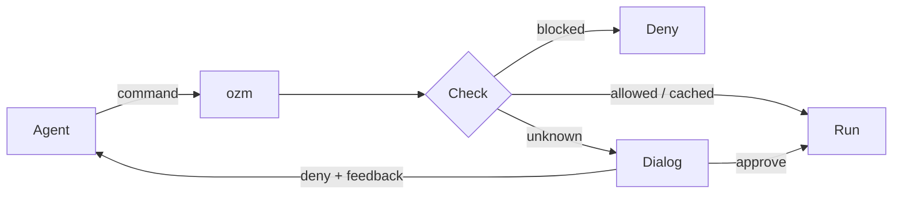

# ozm

Let AI agents run free — without giving up control.

AI coding agents are powerful, but they need to execute commands: installing packages, running tests, writing and executing scripts. Most setups force a choice — either babysit every command, or trust the agent blindly.

`ozm` gives you a third option. It sits between the agent and your shell, gating every command through a content-aware approval system. Approve once, run forever — until something changes.

- **Per-project allowlists** let you pre-approve safe commands so the agent flows uninterrupted
- **Blocklists** prevent dangerous commands from ever running
- **Native macOS dialogs** with syntax-highlighted code review, dark mode support, and inline feedback
- **Diff view** for changed scripts — see exactly what changed before re-approving
- **Editable commands** — modify a command or set an allowlist pattern right in the approval dialog
- **Audit log** — every approval and denial is recorded
- **Config trust** — untrusted `.ozm.yaml` files are flagged before they take effect
- **TTY fallback** — works in terminals without a GUI

No more clicking through identical permission prompts. No more worrying about what the agent just ran.



## Install

```
uv tool install ozm
```

## Quick start

```bash
cd your-project
ozm install --project   # hooks into Claude Code globally, writes CLAUDE.md + AGENTS.md
ozm trust               # trust the .ozm.yaml in this project
```

That's it. From now on, the agent routes all commands through `ozm`.

## Commands

```
$ ozm --help

Commands:
  run      Run a script after content review (hash-gated).
  cmd      Run an arbitrary command after approval.
  git      Git pass-through. Enforces rules on commit and push.
  install  Install ozm hooks system-wide.
  status   Show tracked files and commands with their approval status.
  reset    Forget approval for a script (or all scripts with --all).
  log      Show recent audit log entries.
  doctor   Check ozm installation health.
  trust    Trust the .ozm.yaml in the current project.
```

See [docs/commands.md](docs/commands.md) for detailed usage and examples.

## Per-project configuration

Create a `.ozm.yaml` in your project root:

```yaml
allowed_commands:
  - pytest
  - "uv run *"
  - "uv pip install *"

blocked_commands:
  - "rm -rf *"

commit:
  allow_attribution: false
  require_branch: false
  branch_prefixes: []
```

See [docs/configuration.md](docs/configuration.md) for all options.

## How it works

1. `ozm install` registers a Claude Code `PreToolUse` hook that intercepts all Bash commands
2. The hook blocks direct execution and forces everything through `ozm run`, `ozm cmd`, or `ozm git`
3. Each command/script goes through: blocklist -> allowlist -> project-scoped hash cache -> approval dialog
4. Approved content hashes are stored per-project in `~/.ozm/hashes.yaml`
5. Every decision is logged to `~/.ozm/audit.log`

On macOS, approvals use native Cocoa dialogs with syntax highlighting (via pygments), dark mode support, and inline feedback. On other platforms (or without a display), ozm falls back to a TTY prompt.

## Requirements

- Python 3.12+
- macOS (for native approval dialogs; falls back to TTY prompt on other platforms)
- pygments (optional, for syntax highlighting)
