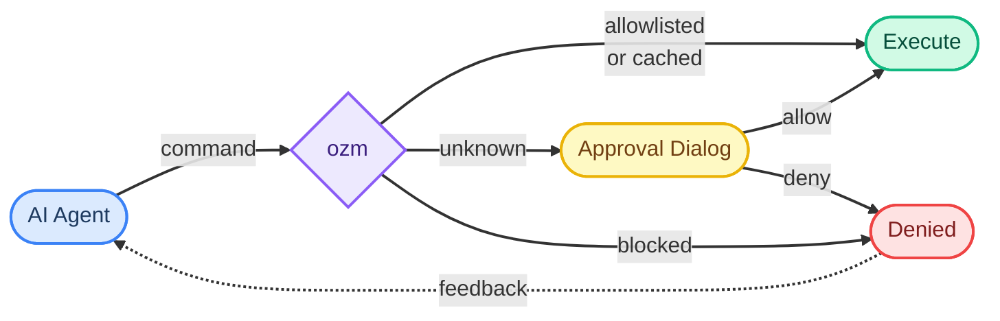

# ozm

ozm - Oberzugriffsmeister (“chief access master”) helps you allow more LLM agent commands without giving too much access.

Let AI agents run free — without giving up control.

AI coding agents are powerful, but they need to execute commands: installing packages, running tests, writing and executing scripts. Most setups force a choice — either babysit every command, or trust the agent blindly.

`ozm` gives you a third option. It sits between the agent and your shell, gating every command through a content-aware approval system. Approve once, run forever — until something changes.

- **Per-project allowlists** let you pre-approve safe commands so the agent flows uninterrupted
- **Blocklists** prevent dangerous commands from ever running
- **Native macOS dialogs** with syntax-highlighted code review, dark mode support, and inline feedback
- **Diff view** for changed scripts — see exactly what changed before re-approving
- **Editable commands** — modify a command or set an allowlist pattern right in the approval dialog
- **Audit log** — every approval, denial, and block is recorded with action source (clicked, cached, config, denied, blocked, no-dialog)

No more clicking through identical permission prompts. No more worrying about what the agent just ran.



## Install

```bash
# via Homebrew
brew tap kamyar/ozm https://github.com/kamyar/ozm
brew install ozm

# or via uv
uv tool install ozm

# or via pip
pip install ozm
```

## Quick start

```bash
cd your-project
ozm install --project   # hooks into Claude Code + Codex, writes CLAUDE.md + AGENTS.md
```

That's it. The agent now routes all Bash commands through `ozm`.

**Optional:** Create `.ozm.yaml` in your project with pre-approved commands and blocklists, then run `ozm trust` to activate it. See [docs/configuration.md](docs/configuration.md).

## Agent compatibility

ozm works with any AI coding agent that executes shell commands:

- **Claude Code** — hooks into the `PreToolUse` system via `~/.claude/settings.json`. The enforcement hook intercepts all Bash tool calls and blocks anything not routed through ozm.
- **Codex / OpenAI agents** — enables Codex hooks in `~/.codex/config.toml`, installs additive execpolicy rules in `~/.codex/rules/ozm-enforcement.rules`, and writes `AGENTS.md` for project-level instructions.
- **Other agents** — any agent that follows instructions in `CLAUDE.md` or `AGENTS.md` will route commands through ozm

For Claude Code and Codex, enforcement is automatic via hooks and policy. For other agents, compliance depends on the agent following the instructions in the project's markdown files.

### Codex install behavior

`ozm install` configures Codex's native hook system and adds an execpolicy rule file that allows `ozm` while forbidding common direct command families such as `git`, `python3`, `bash`, and `./scripts/test.sh`. The hook blocks direct shell tool calls with a clear instruction to use `ozm cmd`, `ozm git`, or `ozm run`.

Restart Codex after installing so new sessions load the updated hook and execpolicy configuration. Use `ozm doctor` inside the project to check Claude hooks, Codex hooks/rules, and project docs.

## Commands

```
$ ozm --help

Commands:
  run      Run a script after content review (hash-gated).
  cmd      Run an arbitrary command after approval.
  git      Git pass-through. Enforces rules on commit and push.
  install  Install ozm hooks system-wide.
  status   Show tracked files and commands with their approval status.
  reset    Forget approval for a script (or all scripts with --all).
  log      Show recent audit log entries.
  doctor   Check ozm installation health.
  trust    Activate a project's .ozm.yaml config.
  version  Show ozm version.
```

See [docs/commands.md](docs/commands.md) for detailed usage and examples.

## Per-project configuration

Configuration is optional. Without it, every command goes through the approval dialog or hash cache. To pre-approve safe commands, create `.ozm.yaml` in your project root:

```yaml
allowed_commands:
  - pytest
  - "uv pip install *"
  - "docker compose *"

blocked_commands:
  - "rm -rf *"

commit:
  allow_attribution: false
  require_branch: false
  branch_prefixes: []
```

Then run `ozm trust` to activate it. This copies `.ozm.yaml` into `~/.ozm/projects/` where ozm actually reads it. The in-repo file is never read at runtime — agents can edit it all they want, but changes have no effect until a human explicitly trusts it.

> **Security note:** Avoid patterns like `"uv run *"` or `"python *"` in `allowed_commands` — these bypass content review for script files. Use `ozm run` for scripts instead, which gates on file content hash. `sed` and `gsed` are never allowlisted because they can edit files in-place; use `rg` for searching, `cat`/`nl`/`head`/`tail` for viewing, or `ozm run <script>` for transformations.

See [docs/configuration.md](docs/configuration.md) for all options.

## How it works

1. `ozm install` registers shell hooks for Claude Code and Codex
2. For Codex, `ozm install` also writes additive execpolicy rules under `~/.codex/rules/`
3. The hook blocks direct execution and forces everything through `ozm run`, `ozm cmd`, or `ozm git`
4. Each `ozm run`, `ozm cmd`, and `ozm git` call must include `--agent-name "<what you are working on>"` and `--agent-description "<one-line intent>"`; missing or multiline metadata is rejected before execution
5. Each command/script goes through: blocklist -> allowlist -> project-scoped hash cache -> approval dialog
6. Approved content hashes are stored per-project in `~/.ozm/hashes.yaml`
7. Every decision is logged to `~/.ozm/audit.log`

On macOS, approvals use native Cocoa dialogs with syntax highlighting (via pygments), dark mode support, agent work context, and inline feedback. Without a GUI session, the command is blocked and the agent receives a clear error — ozm never silently approves.

## Requirements

- Python 3.12+
- macOS with a GUI session (native Cocoa dialogs; no GUI = commands are blocked, not silently approved)
- pygments (optional, for syntax highlighting in dialogs)
