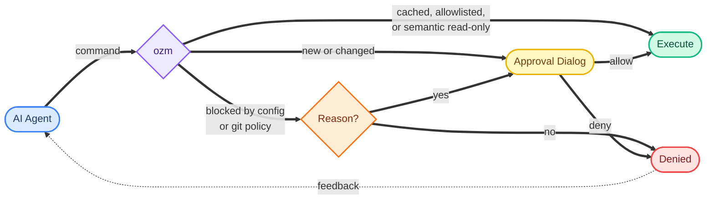

# ozm

ozm - Oberzugriffsmeister ("chief access master") - is a command gate for AI coding agents. It lets agents run useful shell, script, and git commands while risky work still passes through human-owned policy or review.

Most agent setups force a bad choice: babysit every command, or trust the agent blindly. `ozm` gives you a third option. It sits between the agent and your shell, checks command intent and content, and remembers approvals per project so repeated safe work can flow.

- **Hash-gated script review**: scripts run through `ozm run`, are reviewed by content hash, and show diffs when they change.
- **Command approval and caching**: arbitrary argv-style commands run through `ozm cmd`, with exact command approvals cached per project.
- **Global and per-project rules**: allowlist safe command patterns, block dangerous ones, and keep trusted project config outside the repo.
- **Agent work context**: every `ozm run`, `ozm cmd`, and `ozm git` call must include `--agent-name` and `--agent-description`, so approval dialogs show what the agent is trying to do.
- **Native macOS dialogs**: approvals include syntax highlighting, dark mode support, editable commands, rule creation, global/project scope, and inline feedback for the agent.
- **One-time overrides**: blocked config matches and git policy violations can be escalated with `--reason` for explicit user approval without changing caches or allowlists.
- **Git guardrails**: commit message limits, optional attribution and branch rules, no force pushes, no main/master pushes, and dangerous git config/subcommands are blocked.
- **Codex and Claude Code enforcement**: install hooks route direct shell work through `ozm` and write agent instructions for the project.
- **Audit and diagnostics**: `ozm log`, `ozm status`, `ozm config`, and `ozm doctor` expose what happened and how the install is configured.



## Screenshots

> Screenshot placeholder: command approval dialog (`docs/screenshots/command-approval.png`)
>
> Show agent name, agent description, editable command, allow/block rule pattern, Apply globally, and feedback field.

> Screenshot placeholder: changed script diff review (`docs/screenshots/script-diff.png`)
>
> Show a changed script with syntax-highlighted unified diff and approval buttons.

> Screenshot placeholder: diagnostics and status (`docs/screenshots/doctor-status.png`)
>
> Show `ozm doctor`, `ozm config`, and `ozm status` output in a terminal.

## Install

```bash
# via Homebrew
brew tap kamyar/ozm https://github.com/kamyar/ozm
brew install ozm

# or via uv
uv tool install ozm

# or via pip
pip install ozm
```

## Quick start

```bash
cd your-project
ozm install --project
ozm doctor
```

`ozm install --project` installs the Claude Code and Codex hooks, then writes or appends `CLAUDE.md` and `AGENTS.md` instructions in the project. Restart Codex after installing so new sessions load the hook and execpolicy configuration.

Configuration is optional. Without config, unknown commands and new or changed scripts go through the approval dialog. To pre-approve common safe commands or block known dangerous ones, create `.ozm.yaml`, run `ozm trust`, and use `ozm config` to see where the trusted copy lives.

## Agent compatibility

ozm works with any AI coding agent that executes shell commands:

- **Claude Code**: hooks into the `PreToolUse` system via `~/.claude/settings.json`.
- **Codex / OpenAI agents**: enables Codex hooks in `~/.codex/config.toml`, installs additive execpolicy rules in `~/.codex/rules/ozm-enforcement.rules`, and writes `AGENTS.md` for project-level instructions.
- **Other agents**: any agent that follows instructions in `CLAUDE.md` or `AGENTS.md` can route commands through ozm.

For Claude Code and Codex, enforcement is automatic via hooks and policy. For other agents, compliance depends on the agent following the project instructions.

## Safety model

### Scripts: `ozm run`

Use `ozm run` for scripts, not `python script.py`, `bash script.sh`, `uv run`, or `./script.sh` directly.

```bash
ozm run --agent-name "Run tests" --agent-description "Execute the reviewed test script." ./scripts/test.sh
```

Scripts must have a shebang. The first approval stores the script's SHA-256 hash under the current project. Unchanged scripts run without prompting; changed scripts show a diff against the last approved snapshot before they can run again.

### Commands: `ozm cmd`

Use `ozm cmd` for non-script commands.

```bash
ozm cmd --agent-name "Install deps" --agent-description "Install project dependencies." uv pip install -e .
ozm cmd --agent-name "Check API" --agent-description "Call the service health endpoint." curl https://api.example.com/health
```

`ozm cmd` executes argv directly rather than through a shell. It detects script execution and redirects the agent to `ozm run`, refuses `ozm cmd git ...` in favor of `ozm git`, and hard-blocks cases that are unsafe to blanket approve, including `sed`, `gsed`, and `rg --pre`.

Read-only GitHub GraphQL requests such as `gh api graphql -f query=...` are recognized semantically and can run without an approval dialog when the selected operation is definitely a query. Mutations, file-backed queries, malformed documents, or ambiguous multi-operation requests still require review.

### Git: `ozm git`

Use `ozm git` for git operations.

```bash
ozm git --agent-name "Commit fix" --agent-description "Create a short commit for the config fix." commit -m "Fix config loading"
ozm git --agent-name "Inspect status" --agent-description "Check the current git state." status
```

All git subcommands pass through, but policy checks apply to commits, pushes, dangerous history-rewrite commands, and dangerous config keys. Commit messages must use one single-line `-m "message"` with a 72-character subject limit and 500-character total limit. Force pushes and pushes to `main` or `master` are blocked.

If a blocked operation is genuinely necessary, add `--reason "..."` to request a one-time override:

```bash
ozm git --agent-name "Ship hotfix" --agent-description "Push the production fix branch." push --reason "Emergency release approved by the user."
ozm cmd --agent-name "Clean build" --agent-description "Remove generated build artifacts." rm -rf build/ --reason "Clear stale generated output before rebuilding."
```

Approved overrides run once, are logged, and are not cached or converted into allowlist rules.

## Commands

```text
$ ozm --help

Commands:
  cmd      Run an arbitrary command after approval.
  config   Show the path to this project's user-owned config.
  doctor   Check ozm installation health.
  git      Git pass-through.
  install  Install ozm hooks system-wide.
  log      Show recent audit log entries.
  reset    Forget approval for a script (or all scripts with --all).
  run      Run a script after content review (hash-gated).
  status   Show tracked files and commands with their approval status.
  trust    Snapshot the in-repo .ozm.yaml into ~/.ozm/projects/.
  version  Show ozm version.
```

See [docs/commands.md](docs/commands.md) for detailed usage and examples.

## Configuration

Configuration is optional. Without it, every new command or changed script goes through the approval dialog or project-scoped hash cache. To pre-approve safe commands, create `.ozm.yaml` in your project root:

```yaml
allowed_commands:
  - pytest
  - "gh issue view"
  - "gh pr view"
  - "uv pip install *"
  - "docker compose *"

blocked_commands:
  - "rm -rf *"
  - "curl * | sh"

commit:
  allow_attribution: false
  require_branch: false
  branch_prefixes: []
```

Then run `ozm trust` to activate it. This copies `.ozm.yaml` into `~/.ozm/projects/`, where ozm actually reads it. The in-repo file is never read at runtime, so agents can edit it freely but changes have no effect until a human explicitly trusts them.

Use `ozm config` to print the current project root, trusted project config path, global config path, and whether the trusted project config exists.

For commands you want available in every project, add `allowed_commands` or `blocked_commands` to `~/.ozm/config.yaml`, or check **Apply globally** when saving a rule from the command approval dialog. If the rule field is blank, ozm saves the exact command globally. Global and project blocklists are evaluated before any allowlist.

> **Security note:** Avoid patterns like `"uv run *"`, `"python *"`, or `"uv *"` in `allowed_commands`; these bypass content review for script files. Use `ozm run` for scripts instead. `sed`, `gsed`, and `rg --pre` are never allowlisted because they can execute or edit content outside the reviewed script path.

See [docs/configuration.md](docs/configuration.md) for all options.

## How it works

1. `ozm install` writes the enforcement hook and configures Claude Code and Codex to use it.
2. The hook rejects direct risky command families and tells the agent to use `ozm run`, `ozm cmd`, or `ozm git`.
3. `ozm run`, `ozm cmd`, and `ozm git` reject missing, empty, multiline, or malformed agent metadata before execution.
4. Commands are checked against hard safety rules, project/global blocklists, semantic read-only rules, project/global allowlists, and the project-scoped approval cache.
5. Unknown commands and new or changed scripts open a native macOS approval dialog.
6. Approved script contents and exact commands are stored per project in `~/.ozm/hashes.yaml`; changed script snapshots live under `~/.ozm/snapshots/`.
7. Every decision is appended to `~/.ozm/audit.log` with action source such as `clicked`, `cached`, `config`, `semantic`, `override`, `denied`, `blocked`, or `no-dialog`.

On macOS, approvals use native Cocoa dialogs with syntax highlighting via Pygments, dark mode support, agent work context, editable command fields, and inline feedback. Without a GUI session, unknown commands and new or changed scripts are blocked rather than silently approved.

## Requirements

- Python 3.12+
- macOS with a GUI session for new approvals
- Pygments for syntax highlighting (installed by the package dependencies)
