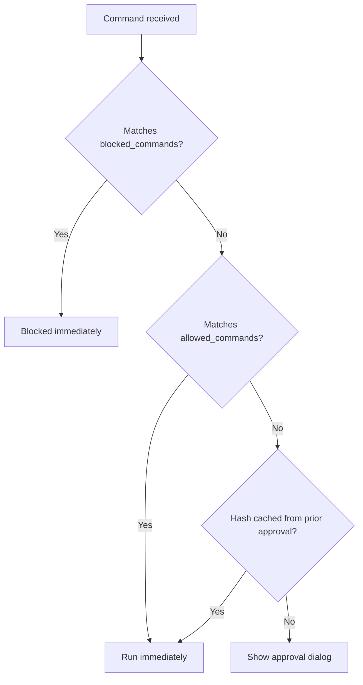

# Configuration

ozm uses two types of configuration:

- **Per-project** — `.ozm.yaml` in your project root
- **Global state** — `~/.ozm/` directory with hashes, audit log, and trust records

## .ozm.yaml

Place this file in your project root (next to `.git`). It controls command allowlists, blocklists, and commit rules for that project.

### Full example

```yaml
allowed_commands:
  - pytest
  - "uv run *"
  - "uv pip install *"
  - "npm test"
  - "git push origin main:main"

blocked_commands:
  - "rm -rf *"
  - "curl * | sh"
  - "wget * | bash"

commit:
  allow_attribution: false
  require_branch: true
  branch_prefixes:
    - "feat/"
    - "fix/"
    - "chore/"
    - "kamy/"
```

### allowed_commands

A list of glob patterns. Commands matching any pattern skip the approval dialog entirely.

```yaml
allowed_commands:
  - pytest                    # exact match
  - "uv run *"               # anything starting with "uv run"
  - "docker compose *"       # any docker compose subcommand
  - "git push origin main:main"  # specific push command
```

Patterns are matched against both the full command string and the first word (the binary name). Uses Python's `fnmatch` glob syntax:

| Pattern | Matches |
|---------|---------|
| `pytest` | `pytest` only |
| `pytest *` | `pytest -v`, `pytest tests/`, etc. |
| `uv *` | `uv run`, `uv pip install`, etc. |
| `curl httpbin.org/*` | `curl httpbin.org/get`, `curl httpbin.org/post` |

### blocked_commands

A list of glob patterns. Commands matching any pattern are denied immediately — no dialog, no override.

```yaml
blocked_commands:
  - "rm -rf *"
  - "curl * | sh"
  - "wget * | bash"
  - "chmod 777 *"
```

Blocklist is checked before the allowlist. If a command matches both, it is blocked.

### commit

Rules enforced by `ozm git commit`.

```yaml
commit:
  allow_attribution: false
  require_branch: true
  branch_prefixes:
    - "feat/"
    - "fix/"
```

| Key | Type | Default | Description |
|-----|------|---------|-------------|
| `allow_attribution` | bool | `true` | When `false`, blocks commits containing `Co-Authored-By:` |
| `require_branch` | bool | `false` | When `true`, blocks commits directly on main/master |
| `branch_prefixes` | list | `[]` | When non-empty, branch names must start with one of these prefixes (main/master are exempt) |

### Evaluation order



## Config trust

When you enter a project with a `.ozm.yaml` you haven't seen before (or one that has changed since you last trusted it), ozm warns you before applying it. This prevents a cloned repository from silently pre-approving commands via its `.ozm.yaml`.

Trust is tracked per-file via SHA-256 hashes stored in `~/.ozm/trusted_configs.yaml`.

**Trust a config explicitly:**

```bash
ozm trust
```

**What happens without trust:**

- `allowed_commands` and `blocked_commands` still work (they restrict, not expand, what runs)
- `commit` rules require trust before taking effect
- Adding allowlist patterns via the dialog automatically re-trusts the config

## Global state (~/.ozm/)

| File | Purpose |
|------|---------|
| `hashes.yaml` | Project-scoped SHA-256 hashes of approved scripts and commands |
| `audit.log` | Append-only log of all approvals, denials, and blocks |
| `trusted_configs.yaml` | SHA-256 hashes of trusted `.ozm.yaml` files |
| `hooks/enforce.sh` | The PreToolUse hook script installed by `ozm install` |

### hashes.yaml

Keys are formatted as `<project_root>:<path_or_command>`:

```yaml
/Users/you/project:/Users/you/project/deploy.sh: abc123...
/Users/you/project:cmd:pytest: def456...
/Users/other/project:cmd:npm test: 789abc...
```

Approvals are project-scoped — approving `pytest` in one project does not carry over to another.

### audit.log

Plain text, one entry per line:

```
2026-04-26 10:15:03  allowed  cmd  /Users/you/project  pytest
2026-04-26 10:15:45  blocked  cmd  /Users/you/project  rm -rf /
2026-04-26 10:16:12  denied   run  /Users/you/project  /path/to/script.sh  # looks suspicious
```

Fields: `timestamp  action  type  working_directory  target  [# feedback]`
