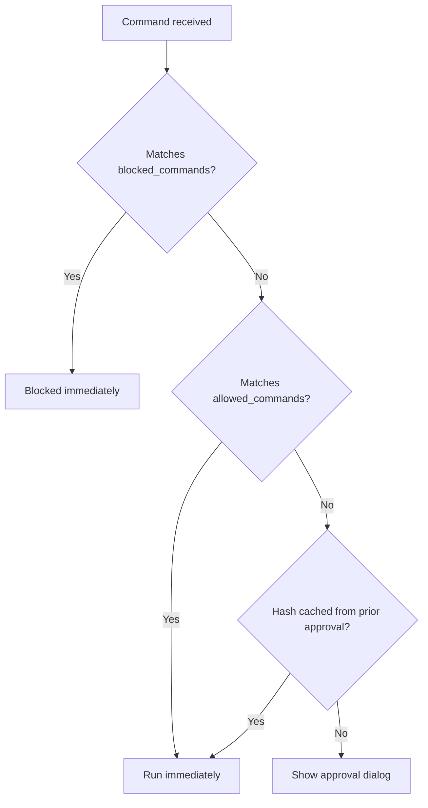

# Configuration

ozm keeps all configuration in `~/.ozm/projects/` — outside the repo, where agents can't reach it.

The in-repo `.ozm.yaml` is never read at runtime. It serves as a template: run `ozm trust` to snapshot it into `~/.ozm/projects/`, where it becomes the active config. This is a security boundary — agents can edit `.ozm.yaml` all they want, but it has no effect until a human explicitly trusts it.

## Setup

```bash
# See where config lives for this project
$ ozm config
project: /Users/you/myproject
config:  /Users/you/.ozm/projects/myproject-a1b2c3d4e5f6g7h8.yaml
status:  not found — run 'ozm trust' to import .ozm.yaml

# Import the repo's .ozm.yaml
$ ozm trust
ozm: copied /Users/you/myproject/.ozm.yaml -> /Users/you/.ozm/projects/myproject-a1b2c3d4.yaml
```

After trusting, you can edit `~/.ozm/projects/myproject-*.yaml` directly. Allowlist patterns added via the approval dialog are saved there automatically.

## Config options

### allowed_commands

A list of glob patterns. Commands matching any pattern skip the approval dialog entirely.

```yaml
allowed_commands:
  - pytest                    # exact match
  - "uv pip install *"       # any uv pip install command
  - "docker compose *"       # any docker compose subcommand
  - "curl httpbin.org/*"     # specific domain only
```

> **Security note:** Avoid patterns like `"uv run *"`, `"python *"`, or `"uv *"` — these bypass content review for script files. Use `ozm run` for scripts instead, which gates on file content hash.
>
> `sed` and `gsed` are never matched by `allowed_commands`, because they can edit files in-place and cannot be safely blanket-approved. Use `rg` for searching, `cat`/`nl`/`head`/`tail` for viewing, or `ozm run <script>` for transformations.

Patterns are matched against both the full command string and the first word (the binary name). Uses Python's `fnmatch` glob syntax:

| Pattern | Matches |
|---------|---------|
| `pytest` | `pytest` only |
| `pytest *` | `pytest -v`, `pytest tests/`, etc. |
| `uv pip install *` | `uv pip install requests`, `uv pip install -e .`, etc. |
| `curl httpbin.org/*` | `curl httpbin.org/get`, `curl httpbin.org/post` |

### blocked_commands

A list of glob patterns. Commands matching any pattern are denied immediately — no dialog, no override.

```yaml
blocked_commands:
  - "rm -rf *"
  - "curl * | sh"
  - "wget * | bash"
  - "chmod 777 *"
```

Blocklist is checked before the allowlist. If a command matches both, it is blocked.

### commit

Rules enforced by `ozm git commit`.

```yaml
commit:
  allow_attribution: false
  require_branch: true
  branch_prefixes:
    - "feat/"
    - "fix/"
```

| Key | Type | Default | Description |
|-----|------|---------|-------------|
| `allow_attribution` | bool | `true` | When `false`, blocks commits containing `Co-Authored-By:` |
| `require_branch` | bool | `false` | When `true`, blocks commits directly on main/master |
| `branch_prefixes` | list | `[]` | When non-empty, branch names must start with one of these prefixes (main/master are exempt) |

### Evaluation order



## Global state (~/.ozm/)

| Path | Purpose |
|------|---------|
| `projects/<name>-<hash>.yaml` | Per-project config (allowlists, blocklists, commit rules) |
| `hashes.yaml` | Project-scoped SHA-256 hashes of approved scripts and commands |
| `audit.log` | Append-only log of all approvals, denials, and blocks |
| `hooks/enforce.sh` | The PreToolUse hook script installed by `ozm install` |

### hashes.yaml

Keys are formatted as `<project_root>:<path_or_command>`:

```yaml
/Users/you/project:/Users/you/project/deploy.sh: abc123...
/Users/you/project:cmd:pytest: def456...
/Users/other/project:cmd:npm test: 789abc...
```

Approvals are project-scoped — approving `pytest` in one project does not carry over to another.

### audit.log

Plain text, one entry per line:

```
2026-04-26 10:15:03  cached     cmd  /Users/you/project  pytest
2026-04-26 10:15:45  blocked    cmd  /Users/you/project  rm -rf /
2026-04-26 10:16:12  denied     run  /Users/you/project  /path/to/script.sh  # looks suspicious
2026-04-26 10:17:01  clicked    run  /Users/you/project  /path/to/deploy.sh
2026-04-26 10:18:30  config     cmd  /Users/you/project  docker compose up
2026-04-26 10:19:00  no-dialog  run  /Users/you/project  /path/to/new.sh
```

Fields: `timestamp  action  type  working_directory  target  [# feedback]`

Actions: `clicked` (user approved in dialog), `cached` (hash matched prior approval), `config` (matched allowlist), `denied` (user denied in dialog), `blocked` (matched blocklist), `no-dialog` (dialog could not be shown, command blocked)
